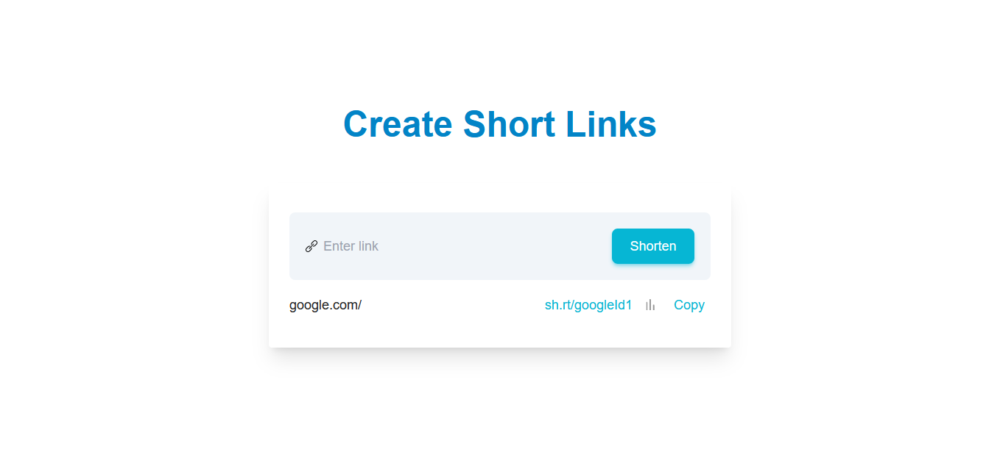
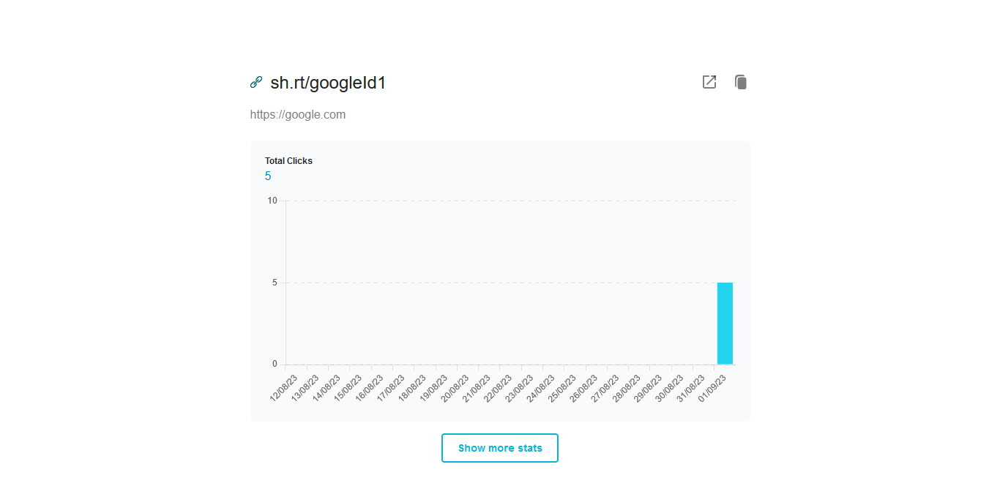

# UrlShortener

The project does what its name implies–it creates short links(URLs) that redirect to long ones. In addition, it collects and visualizes the clicks on the Short URLs.

Here are the decisions I made to make the code reliable and maintainable:

- I used Clean Architecture to increase testability and to decouple the business rules from details like the framework and the database.
- I used TDD to create a good design, produce executable documentation, and get a high test coverage.
- I wrote high confidence UI tests by testing from the user’s perspective.
- I used Consumer-Driven Contracts to test the integration between the Front-End and the Back-End–avoiding slow and flaky E2e tests.
- I enabled CI(Continuous Integration) by creating a deployment pipeline that uses a Load test and a DAST(Dynamic Application Security Test).
- I added a SAST(Static Application Security Test) by enabling Github’s CodeQL.

## Features

- Redirect URLs
- Generate click data
  - Top device type
  - Total clicks

## Screenshots





## Environment Variables

### Server environment variables

#### Required

- `SERVER_DOMAIN` - The domain of the short URLs. Eg. sh.rt
- `CLIENT_ORIGIN` - The origin the client is hosted on(used to setup CORS)
- `MONGODB_URI` - URI of the MongoDB service
- `MONGODB_DATABASE_NAME` - Name of the database to be used

#### Optional

- `PORT` - The port the server will be listening on

### Client environment variables

#### Required in staging and production

- `NEXT_PUBLIC_API_BASE_URL` - The URL the server is running on

#### Required in development

- `NEXT_PUBLIC_API_MOCKING` - Used to mocker server requests

## Running Locally

- Install dependencies:

```bash
  npm install
```

- Start MongoDB service
- Set required server environment variables

```bash
  SERVER_DOMAIN={sample domain}
  CLIENT_ORIGIN={sample origin Eg. https://client-origin-for-cors.com}
  MONGODB_URI=mongodb://{The address of the DB service}
  MONGODB_DATABASE_NAME={Your preferred database name}
```

- Start server project:

```bash
  npx nx run server:serve
```

- Set required client environment variables

```bash
  NEXT_PUBLIC_API_BASE_URL={The URL the server is running on. Eg. http://localhost:3000}
```

- Start client project

```bash
  npx nx run client:serve
```

## Running Tests

Client tests:

```bash
  npm nx run client:test
```

Server tests:

```bash
  npm nx run server:test
```

## Tech Stack

**Client:** Typescript, Next.js, TailwindCSS

**Server:** Typescript, Node.js, ExpressJS, MongoDB, Pino

## API Reference

The full RESTAPI specification can be found [here](packages/server/src/adapter-restapi-express/apiSpec.yml).

### Get shortened url

```http
  GET /api/urls/{shortenedId}
```

| Parameter     | Type     | Description                    |
| :------------ | :------- | :----------------------------- |
| `shortenedId` | `string` | **Required**. Shortened URL Id |

### Get top device types

```http
  GET /api/urls/{shortenedId}/top-device-types
```

| Parameter     | Type     | Description                    |
| :------------ | :------- | :----------------------------- |
| `shortenedId` | `string` | **Required**. Shortened URL Id |

### Get total clicks by day

```http
  GET /api/urls/{shortenedId}/total-clicks-by-day
```

| Parameter     | Type     | Description                    |
| :------------ | :------- | :----------------------------- |
| `shortenedId` | `string` | **Required**. Shortened URL Id |

### Shorten Url

```http
  POST /api/urls
```

| Parameter | Type     | Description                       |
| :-------- | :------- | :-------------------------------- |
| `url`     | `string` | **Required**. URL to be shortened |

### Greeting

```http
  GET /api
```
